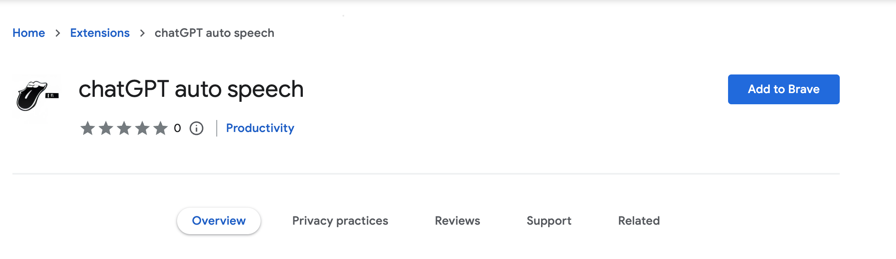
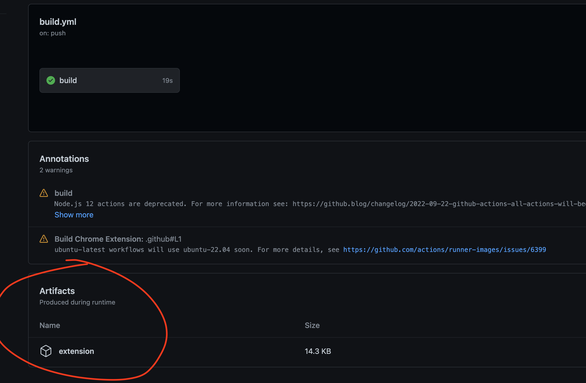

# Chrome extension for human-like conversation for you and chatGPT

fun fact: this code is co-written by chatGPT and me(I mean, a human, of course).

fun fact 2: so it is full of bugs now! but seriously please help if you are interested.

## Feature

just listen and talk, a more human-like conversation for you and chatGPT.

### 1. Use voice for typing

1. Press and hold the right shift key on your keyboard when you want to talk to chatGPT, the voice will be converted into text on the textarea.
2. Press enter to send the message.

### 2. Convert chatGPT response text into speech

auto convert the response text from chatGPT into speech.

## How to install

### 1. Install from the chrome web store

https://chrome.google.com/webstore/detail/chatgpt-auto-speech/jliflimkjclgbmfficnhimfdmmikpabb

### 2. Install from the local file

the GitHub CI will build an `extension.zip` file for every commit in the master branch.

example: https://github.com/RetricSu/chatGPT-auto-speech/actions/runs/3657606515

- download and unzip the file.
- open the `brave://extensions/` or `chrome://extension` tab on your browser
- use `Load unpacked` button on the top left to select the file folder you just unzip.
- done!

open https://chat.openai.com/chat to enjoy your speaking AI!
